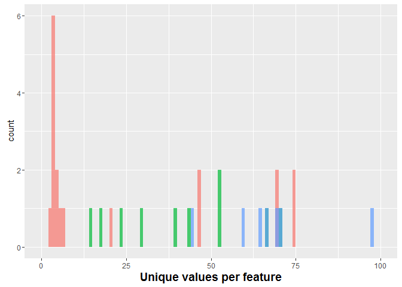
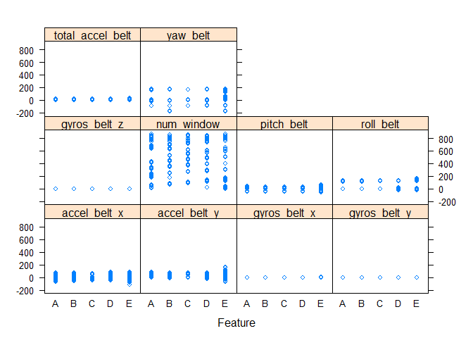
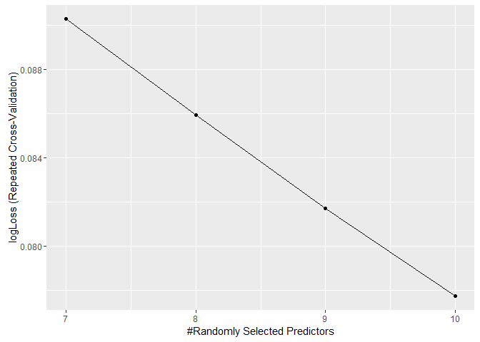

Practical Machine Learning Prediction Assignment
================

Overview
--------

We look into a dataset of barbell lifts, labelled with 5 different categories. These barbell lifts are quantified and measured with various acceleromotors on the belt, forearm, arm, and dumbell. These data are used to train a predictive model primarily via R's caret package. We consider the out of sample error, so to assess the generalization of the model. Finally, we predict the class labels against a previously unseen set of test data.

Loading the data
----------------

The testing and training data are downloaded from <http://groupware.les.inf.puc-rio.br/har> into R.

``` r
# Download files into directory if they've not already been downloaded
training_data_url = "https://d396qusza40orc.cloudfront.net/predmachlearn/pml-training.csv"
testing_data_url = "https://d396qusza40orc.cloudfront.net/predmachlearn/pml-testing.csv"

if (!file.exists("pml-training.csv")) {
  download.file(training_data_url,"pml-training.csv")  
}

if (!file.exists("pml-testing.csv")) {
  download.file(testing_data_url,"pml-testing.csv")  
}

training = read.csv("pml-training.csv",stringsAsFactors = FALSE)
testing = read.csv("pml-testing.csv",stringsAsFactors = FALSE)

# Create combined data frame in order to apply common preprocessing operations
# Note, this combination can only be used to apply common preprocessing steps
# And cannot be used for model building/training otherwise the model will never generalize.
classeSave = training$classe
problem_idSave  = testing$problem_id
training$classe = NULL
testing$problem_id = NULL
combined = as.data.table(rbindlist(list(training,testing)))
```

Exploratory data analysis
-------------------------

Exploratory data analysis is performed, to guide what steps we make take in data preparation, feature selection and feature engineering. We note the proportion of NA values in the dataset, considering that their removal, or imputation, might be data handling options. We also look for constant values in the data set, with a view to their removal.

``` r
feature_info = data.table(feature=names(combined))
feature_info[,type := unlist(lapply(combined,class))]
feature_info[,min_value := unlist(lapply(combined,min,na.rm = T))]
feature_info[,max_value := unlist(lapply(combined,max,na.rm = T))]
feature_info[,unique_ct := unlist(lapply(combined,function(x) { length(unique(x)) } ))]
feature_info[,hasNA := unlist(lapply(combined,function(x) { any(is.na(x)) } )) ]
feature_info[,countNA := unlist(lapply(combined,function(x) { length(which(is.na(x))) } )) ]
feature_info[,countBlank :=  unlist(lapply(combined,function(x) length(which(x == "")))) ]
feature_info[,hasBlanks :=  countBlank > 0]

cat("Training Row count : ", nrow(training), "; Predictor column count : ", ncol(training))
```

    ## Training Row count :  19622 ; Predictor column count :  159

``` r
# Proportion of na values

length(training[is.na(training)])/(ncol(training)*nrow(training))
```

    ## [1] 0.4126648

``` r
# Check for duplicate rows
nrow(training) - nrow(unique(training))
```

    ## [1] 0

``` r
# Check for columns with one unique value
cat("Constant feature count", nrow(feature_info[unique_ct == 1]))
```

    ## Constant feature count 0

Next, we count out how many features have no NA values and NO blank values, the idea being to retain only those features as an approach to feature selection. Certainly there are other more involved and rigorous approaches to handling missing values than just skipping them. However, as a first pass we attempt to identify them with a view to their later removal, and will revisit this decision should the out of sample error in their absence turn out to be poorer than we might like.

``` r
# How many features don't have any NA/blank data
nrow(feature_info[!(hasNA == T | hasBlanks == T )])
```

    ## [1] 59

``` r
# How many features have NA/blank data
nrow(feature_info[hasNA == T | hasBlanks == T ])
```

    ## [1] 100

``` r
#Now lets look at the number of unique values per column.

# lets plot the unique values per feature
ggplot(feature_info[unique_ct <= 100], aes(x = unique_ct, fill=type)) + 
  geom_histogram(binwidth = 1, alpha=0.7, position="identity") + xlim(c(0,100)) +
  xlab("Unique values per feature")+ theme(legend.position = "none") + theme(axis.title.x=element_text(size=14, ,face="bold"))
```

    ## Warning: Removed 6 rows containing missing values (geom_bar).



Preprocess the data
-------------------

The data is preprocessed as follows. The features with NAs or blanks are removed, leaving around 59 features out of the original 159. Next, certain columns are blacklisted and removed, since they appear to be usernames or timestamps, unique to persons and/or events, and therefore naturally unlikely to generalize to future unseen data.

``` r
# For simplicity sake, remove the features with NA or blanks
na_or_blank_col_names = feature_info[hasNA == T | hasBlanks == T,feature ]
combined[ ,(na_or_blank_col_names) := NULL]

# Blacklist some columns which appear to be, on their face, not useful for model building
# on a type of exercise, such as a row number, user_name and timestamps
black_list_cols = c("X","user_name","raw_timestamp_part_1","raw_timestamp_part_2","cvtd_timestamp")
combined[ ,(black_list_cols) := NULL]

# Check for near zero variance columns and remove because its a quick a dirty way to pare down the 
# feature set. If we don't get good generalization performance later on we'll revisit.
zero.var = nearZeroVar(combined, saveMetrics=TRUE)
zero_var_col_names = rownames(zero.var[zero.var$nzv == T,])
combined[ ,(zero_var_col_names) := NULL]

# Having cleaned the combined data, build the prediction data frames
Xtrain = head(combined,nrow(training))
Xtest = tail(combined,nrow(testing))
Ytrain = as.factor(classeSave)
```

Here is a feature plot where the relationships between a subset of features and outcomes are explored.

``` r
# Crashes R if done all at once
featurePlot(Xtrain[,names(Xtrain)[1:10],with=F], Ytrain, "strip")
```



Model Building
--------------

For model building, we select the random forest algorithm, for the simple reason that is has performed well in the past per the lecture and that rf is relatively interpretable in terms of variable importances. We use cross validation to perform model parameter tuning as well. In particular, we do 3 repeats of 3-Fold cross validation for the barbell lift data. We evaluate 4 values of mtry, a primary parameter to the rf model. This means a total of 36 models are fit, because for each fold, of which there are 3, we run with each of the 4 different parameters, for a total of 12 fits. This set of 12 fits, is repeated 3 times, for a total of 36. Furthermore, we set the seeds argument such that the model, even through run in parallel, is reproducible.

``` r
# create a list of seeds for reproducability reasons
set.seed(144)
seeds <- vector(mode = "list", length = 10)
for(i in 1:9) seeds[[i]] <- sample.int(1000, 4)
## For the last model:
seeds[[10]] <- sample.int(1000, 1)


# Need to set the seeds parameter to trainControl properly in order to 
# get a reproducible model fit.
fitControl=trainControl(method="repeatedcv", number=3,repeats=3,
                                       classProbs = TRUE, verboseIter = T, seeds = seeds,
                                       summaryFunction = multiClassSummary, allowParallel = T)

rfFit <- train(x = Xtrain, y=Ytrain,
               method = "rf",
               trControl = fitControl
               ,tuneGrid = expand.grid(mtry=7:10)
               ,metric = "logLoss"
)
```

    ## Loading required package: randomForest

    ## Warning: package 'randomForest' was built under R version 3.2.5

    ## randomForest 4.6-12

    ## Type rfNews() to see new features/changes/bug fixes.

    ## 
    ## Attaching package: 'randomForest'

    ## The following object is masked from 'package:gridExtra':
    ## 
    ##     combine

    ## The following object is masked from 'package:ggplot2':
    ## 
    ##     margin

    ## Aggregating results
    ## Selecting tuning parameters
    ## Fitting mtry = 10 on full training set

Here's a look at the most important variables in our model.

``` r
varImp(rfFit)
```

    ## rf variable importance
    ## 
    ##   only 20 most important variables shown (out of 53)
    ## 
    ##                      Overall
    ## num_window            100.00
    ## roll_belt              79.42
    ## yaw_belt               51.27
    ## pitch_forearm          47.92
    ## magnet_dumbbell_z      42.85
    ## pitch_belt             41.30
    ## magnet_dumbbell_y      40.38
    ## roll_forearm           33.46
    ## magnet_dumbbell_x      24.25
    ## accel_dumbbell_y       21.13
    ## roll_dumbbell          20.95
    ## accel_belt_z           19.54
    ## magnet_belt_z          18.26
    ## magnet_belt_y          17.28
    ## accel_forearm_x        16.12
    ## accel_dumbbell_z       15.81
    ## roll_arm               14.01
    ## total_accel_dumbbell   12.89
    ## gyros_belt_z           12.85
    ## magnet_forearm_z       12.46

Out of Sample Error
-------------------

Here's a plot of our model's logLoss, which is the multi-class loss function used to evaluate the model's performance. We note that the mtry value of 10 shows the lowest logloss, considered through the lens of cross validation. caret then returns the model with an mtry value of 10 as its final model. We note that the OOB estimate of error rate is 0.12%, which is around 1/10th of 1%. This looks good enough so we are satisfied with our feature selection approach earlier and chose not to revisit.

``` r
ggplot(rfFit)
```



``` r
rfFit$finalModel
```

    ## 
    ## Call:
    ##  randomForest(x = x, y = y, mtry = param$mtry) 
    ##                Type of random forest: classification
    ##                      Number of trees: 500
    ## No. of variables tried at each split: 10
    ## 
    ##         OOB estimate of  error rate: 0.12%
    ## Confusion matrix:
    ##      A    B    C    D    E  class.error
    ## A 5579    0    0    0    1 0.0001792115
    ## B    3 3793    1    0    0 0.0010534633
    ## C    0    6 3416    0    0 0.0017533606
    ## D    0    0    9 3206    1 0.0031094527
    ## E    0    0    0    2 3605 0.0005544774

Prediction
----------

Lastly, we predict on the previously unseen testing data, which correctly identified 20 out of 20 of the test cases.

``` r
predictions = data.frame(problem_id=problem_idSave,classe=predict(rfFit,newdata=Xtest))
```
